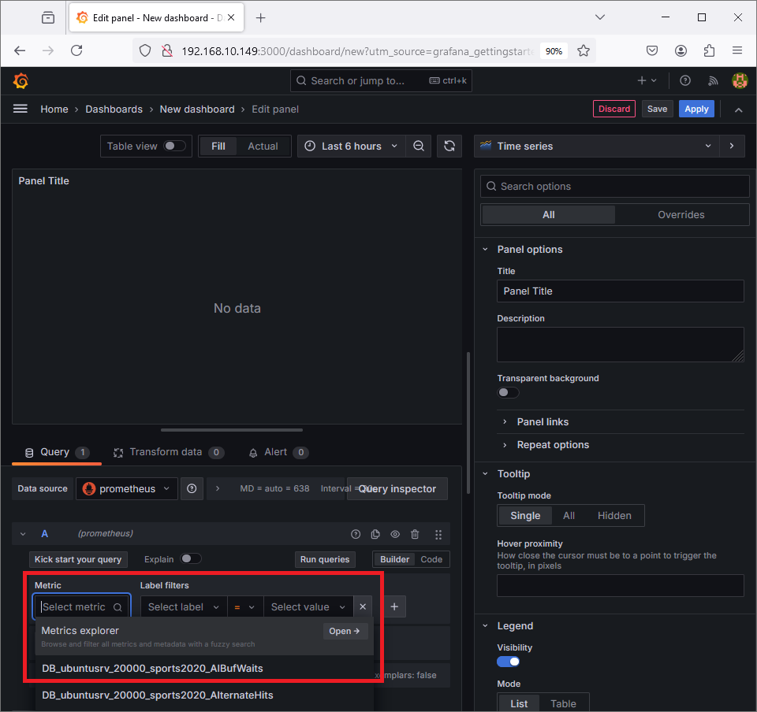
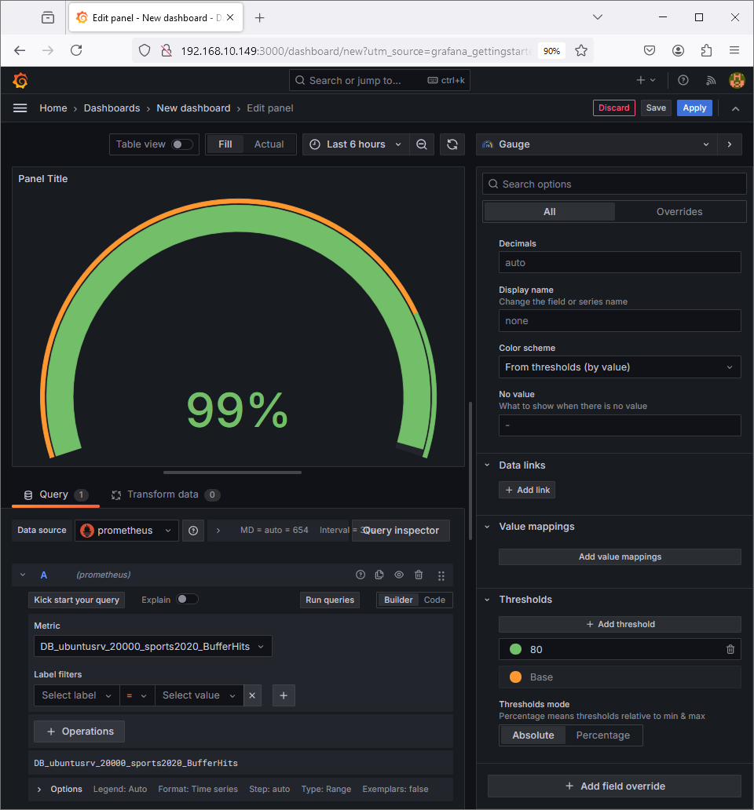
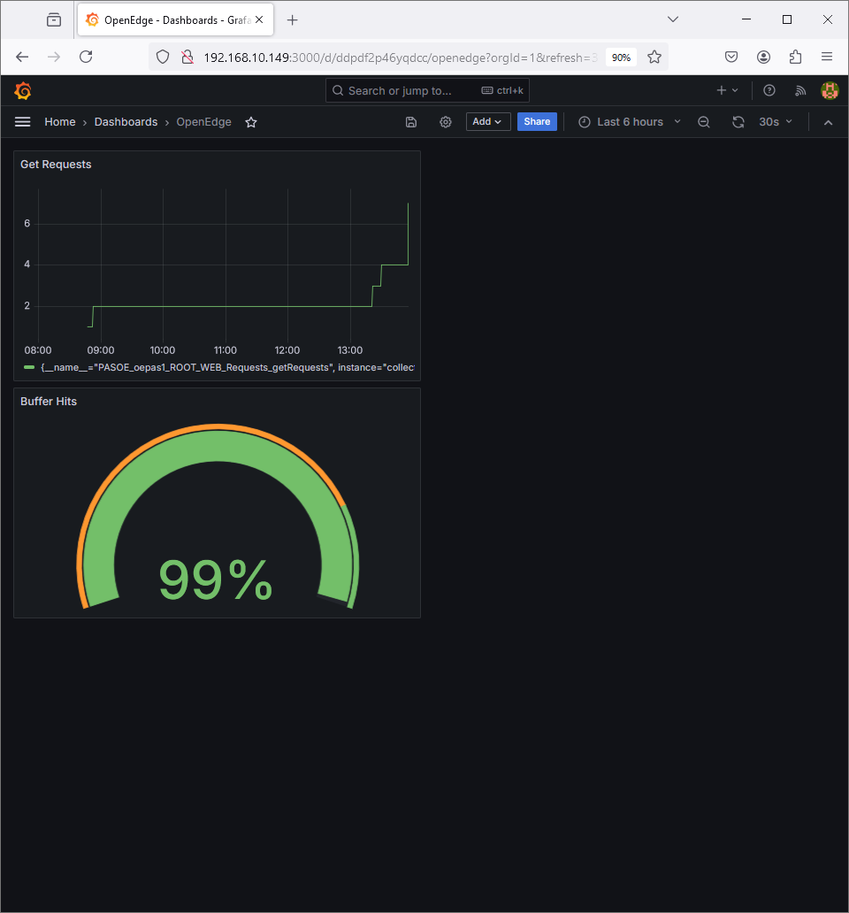

# OpenEdge Command Center #

Demo scripts to setup an OpenEdge Command Center environment with support for OpenTelemetry metrics.

The scripts are an updated version of the scripts used for the following blog post:
* https://www.progress.com/blogs/using-opentelemetry-metrics-support-openedge-azure

In the new version, the scripts can be used on an Ubuntu VM running on various virtualization options such as AWS, Azure, VirtualBox or VMWare Fusion.

Scripts run commands to detect the IP address of the machine.

### Requirements 
* Ubuntu Linux 22.04
    * user with sudo access
* OpenEdge media:
    * PROGRESS_OE_12.8.3_LNX_64.tar.gz
    * PROGRESS_OECC_SERVER_1.3.0_LNX_64.tar.gz
    * PROGRESS_OECC_AGENT_1.3.0_LNX_64.bin
* Reponse file for OpenEdge installation:
    * response_12.8.3.ini
    * Products:
        * OE Adv. Ent. RDBMS
        * 4GL Development System
        * Progress ProdAS for OE

**Notes:**
* The OpenEdge media for both OpenEdge and OpenEdge Command Center can be downloaded from the Progress OpenEdge 12.8.x section in the ESD site.
* You can use the `OpenEdge-Samples/examples/OECC/config/response_12.8.3.ini` file as a template and specify the control codes in the file.
* The demo scripts install the components using the media and the response .ini file.
* The demo scripts install OpenJDK to `/usr/lib/jvm/jdk` and OpenEdge to `/psc/dlc`.
* The demo scripts install Docker Engine on Ubuntu using the instructions at https://docs.docker.com/engine/install/ubuntu/.

### Components 
The infrastructure uses multiple components. To simplify the deployment, it uses a single virtual machine with some components running at the OS level and others running as a container using Docker.

* Ubuntu Virtual Machine latest 22.04 (tested 22.04.4)
    * OpenEdge Database 12.8.3
    * PAS for OpenEdge 12.8.3
    * OpenEdge Command Center agent 1.3.0
    * Docker (latest, version tested: 26.1.4)
        * OpenTelemetry Collector 0.53.0
        * Prometheus (latest, version tested: v2.53.0)
        * Grafana (latest, version tested: 9.5.20)
        * MongoDB 4.4-rc-focal
        * OpenEdge Command Center server 1.3.0

The OpenEdge Database, PAS for OpenEdge and the OpenEdge Command Center agent are installed at the OS level.
The OpenTelemetry Collector, Prometheus, Grafana, MongoDB, and the OpenEdge Command Center server are deployed using Docker.

The following diagram shows the components use for OpenTelemetry support.

See related diagram at 
https://www.progress.com/openedge/features/command-center

### Steps

#### Preparing the installation with the prerequisites
1. Create `/install` directory used for the installation files.
~~~
sudo mkdir -p /install
sudo chown $USER /install
~~~

2. Copy the OpenEdge media files and the response file to `/install`.

#### Setting up the environment

1. Clone the OpenEdge-Samples repo:
~~~
cd
git clone https://github.com/progress/OpenEdge-Samples.git
~~~

2. Run `setup.sh` in the `OECC/scripts` directory. Script uses `sudo` to perform administrator tasks.
~~~
cd ~/OpenEdge-Samples/examples/OECC
./scripts/setup.sh
~~~

#### Testing the environment

1. Test the configuration.
~~~
./scripts/test.sh
~~~

2. Access OpenEdge Command Center via a web browser:
    * http://&lt;host-machine&gt;:8000
    * Use admin/admin to login

3. Access the PAS for OpenEdge instance via a web browser:
    * http://&lt;host-machine&gt;:8810
    * http://&lt;host-machine&gt;:8810/web/customer.p

4. Access Prometheus via a web browser:
    * http://&lt;host-machine&gt;:9090
    * Use DB_ in the Expression field to query for metrics for the OpenEdge database
    * Use PASOE_ in the Expression field to query for metrics for PAS for OpenEdge

5. Access Grafana via a web browser:
    * http://&lt;host-machine&gt;:3000
    * Use admin/admin to login

**Notes:**
* The setup script, adds `/etc/rc.local` to start the configuration on startup of the machine. You can also use `./scripts/start.sh` and `./scripts/stop.sh` to manually start and stop the configuration.

### Creating a Dashboard in Grafana

**Steps**

1. Click on DATA SOURCES then on Prometheus to create a data source with the following values:
    * Prometheus server URL: http://prometheus:9090
        * Prometheus is a reference to a service in the `docker-compose.yaml` file and can be used as a hostname.
    * Scroll down and click on Save & Test

2. Click on Home then on DASHBOARDS to create a dashboard.
3. Click on Add visualization to add a visualization for an OpenEdge database metric.
    * Select Prometheus as the data source.
    * Click on "Select metric" and click on Open.

    * Search for "DB_" and select the BufferHits metric from the list.

    * Click on Run queries.
    * Click on Time series to change the visualization to use a Gauge.
    * Change the Panel Title to "Buffer Hits"
    * Scroll down and change the Unit in "Standard options" to Misc / Pecent (0-100).
    * Scroll down and click on the Red dot for the Threshold to use Green.
    * Click on the Green dot for Base to use Orange.
    * Click on Apply.

4. Click on Add / Visualization (on toolbar) to add a visualization for a PASOE metric.
    * Click on "Select metric" and click on Open.
    * Search for "getrequests" and select the getRequests metric from the list.
    * Click on Run queries.
    * Change the Panel Title to "Get Requests".
    * Click on Apply.
5. Click on the "Save dashboard" button (floppy disk icon on toolbar) to save the dashboard.

Notes:
* Examples of Grafana dashboards can be found at https://grafana.com/grafana/dashboards/
